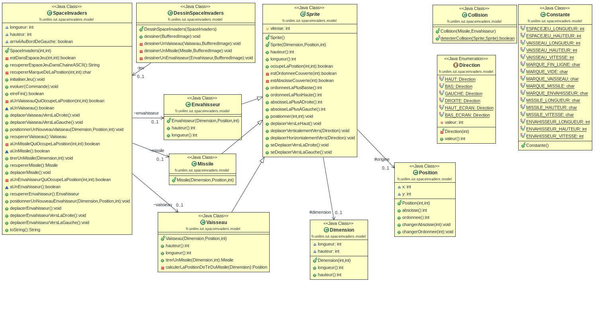
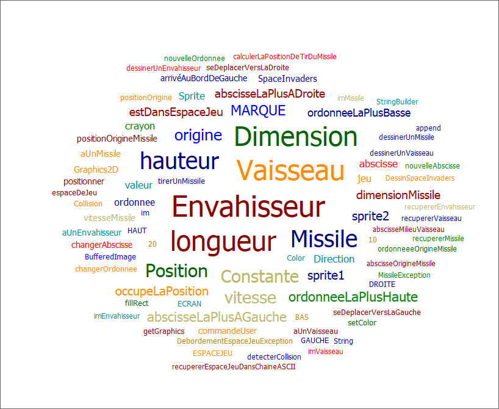
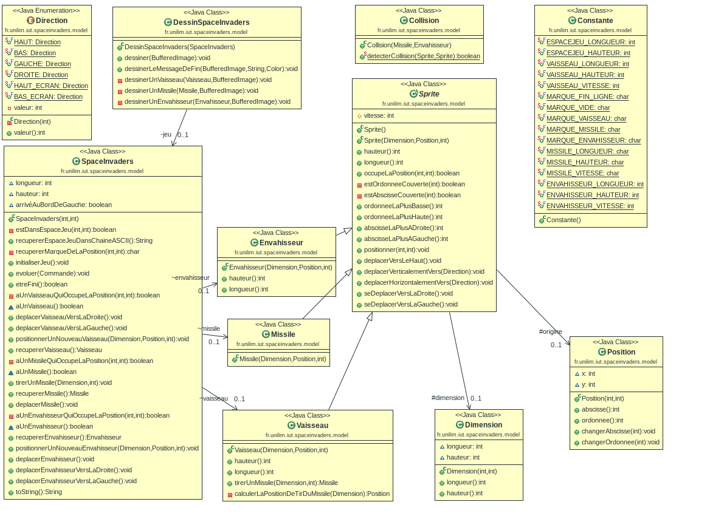
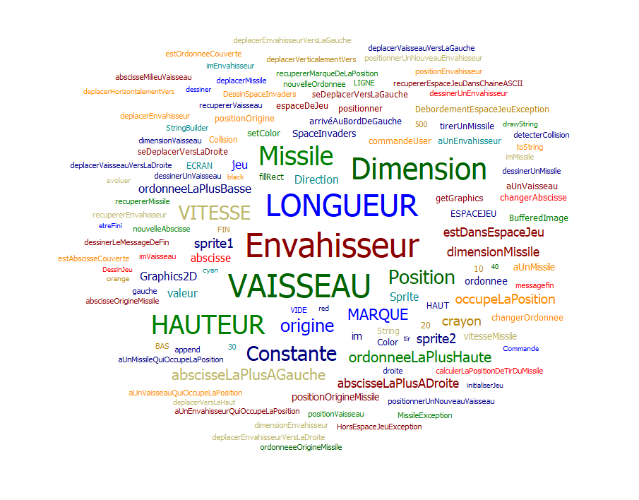

# Space Invaders - Rapport à chaque scéance

# Semaine du lundi 29 juin au vendredi 3 mai 2019

Pendant les vacances j'ai avancée jusqu'à la moitié de la fonctionnalité 4, mais suite à des problèmes 
au niveau des tests, j'ai dû attendre la rentrée pour réparer le problème. Donc à la dernière scéance 
je n'ai pas pu travailler, car rien ne marcher. Nous avons donc installé Manjaro et depuis tout fonctionne 
parfaitement. J'ai donc fini la fonctionnalité 4.

# Voici mon diagramme de classe : 

# Voici mon nuage de mots : 

-------------------------------------------------------------------------------------------------------------

# Semaine du lundi 6 mai au vendredi 10 mai 2019

Cette semaine j'ai commencé la fonctionnalité 5, j'ai donc créé mon envahisseur. C'était assez simple, 
il fallait reprendre la fonctionnalité "créer un vaisseau" mais cette fois pour créer un envahisseur. J'ai 
refais également des tests. De plus, j'ai dû créer une méthode qui permet de déplacer automatiquement 
l'envahisseur et aussi vérifier qu'il ne sorte pas de l'espace de jeu. 
Ma fonctionnalité 5 est finie.

# Voici mon diagramme de classe : 

# Voici mon nuage de mots : 

-------------------------------------------------------------------------------------------------------------

# Semaine du lundi 13 mai au vendredi 17 mai 2019

J'ai commencé à réfléchir à la fonctionnalité 6, la collision. 
J'ai créé une classe Collision et une méthode detecterCollision. 
J'ai fait des tests pour mes dimensions dans Test Collision, et un dans 
Test SpaceInvaders pour savoir si la collision à bien lieu et la disparition aussi. 
J'ai fait la méthode detecterCollision, tout fonctionne 
(il y a certains cas particuliers que je n'ai pas traité). 

# Voici mon diagramme de classe : 

# Voici mon nuage de mots : 

-------------------------------------------------------------------------------------------------------------

# Semaine du lundi 20 mai au vendredi 24 mai 2019

Je vais donc commencer la fonctionnalité 7. Il suffisait de rajouter une condition pour que le vaisseau
disparaisse à la fin du jeu.

# Voici mon diagramme de classe : 

# Voici mon nuage de mots : 

-------------------------------------------------------------------------------------------------------------

# Semaine du lundi 20 mai au vendredi 24 mai 2019

 J'ai fais afficher un message quand le joueur gagne.
 Puis j'ai rajouté des tests pour la collision.
 
# Voici mon diagramme de classe : 

# Voici mon nuage de mots : 

