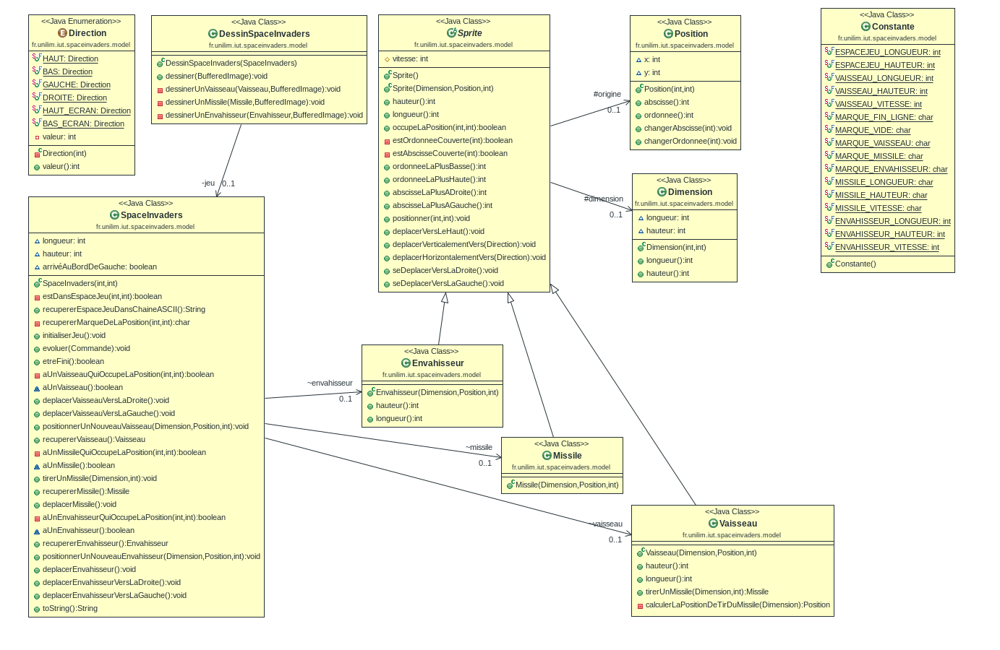
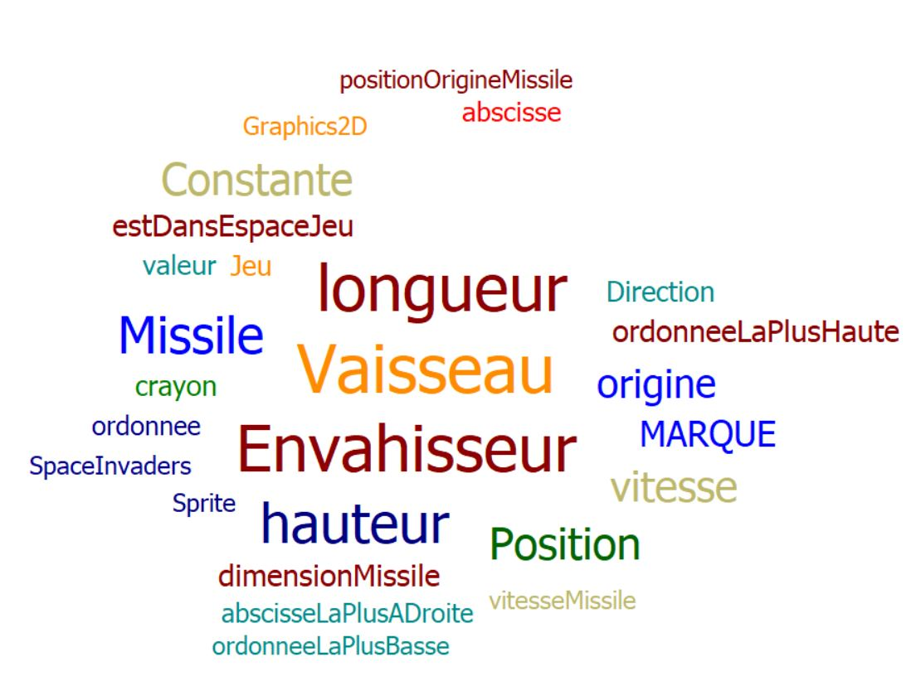

# Space Invaders - Rapport à chaque scéance

# Semaine du lundi 6 mai au vendredi 10 mai 2019

Pendant les vacances j'ai avancée jusqu'à la moitié de la fonctionnalité 4, mais suite à des problèmes 
au niveau des tests, j'ai dû attendre la rentrée pour réparer le problème. Donc à la dernière scéance 
je n'ai pas pu travailler, car rien ne marcher. Nous avons donc installé Manjaro et depuis tout fonctionne 
parfaitement. J'ai donc fini la fonctionnalité 4.

# Voici mon diagramme de classe : 

# Voici mon nuage de mots : 

-------------------------------------------------------------------------------------------------------------

# Semaine du lundi 6 mai au vendredi 10 mai 2019

Cette semaine j'ai commencé la fonctionnalité 5, j'ai donc créé mon envahisseur. C'était assez simple, 
fallait reprendre la fonctionnalité "créer vaisseau" mais cette fois pour créer un envahisseur. J'ai 
refais également des tests. De plus, j'ai dû créer une méthode qui permet de déplacer automatiquement 
l'envahisseur et aussi vérifier qu'il ne sorte pas de l'espace de jeu. 
Ma fonctionnalité 5 est finie.

# Voici mon diagramme de classe : 

# Voici mon nuage de mots : 

Maintenant je commence à refléchir à la fonctionnalité 6, la collision de Sprites. 
J'ai créé une classe Collision et une méthode detecterCollision. 
