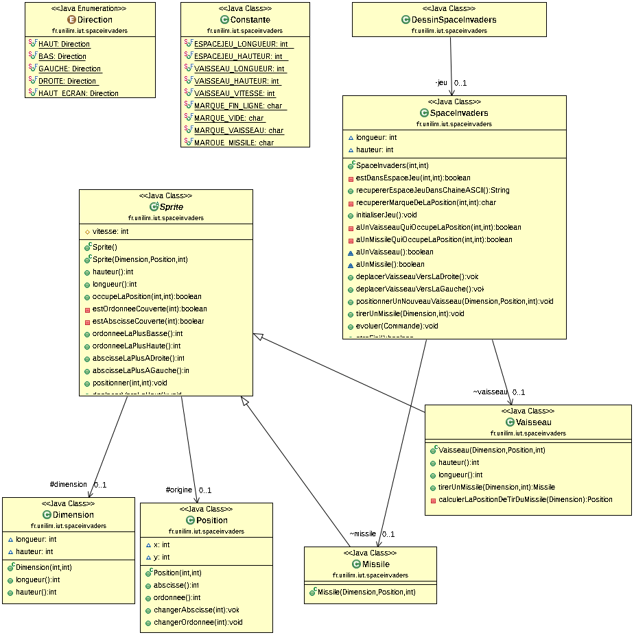
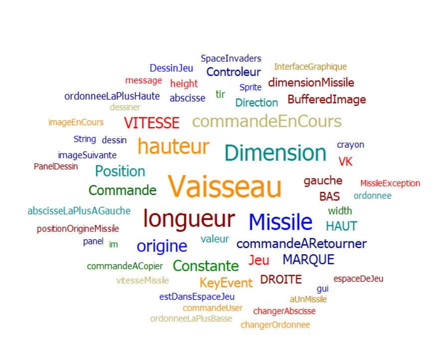

# spaceinvaders

# Semaine du 6 mai au 12 mai.

# J'ai terminé ce week end la fonctionnalité 4, car pendant les vacances j'ai avancer jusqu'à la moitié de 
la fonctionnalité 4, mais suite à des problèmes au niveau des tests, j'ai
du attendre la rentrée pour reparer le problème. Donc à la dernière scéance
je n'ai pas pu travailler car rien ne marcher. Nous avons donc installer Manjaro
et depuis tout fonctionne. J'ai donc fini la fonctionnalité 4. 

# Voici mon diagramme de classe : 

# Voici mon nuage de mots : 

